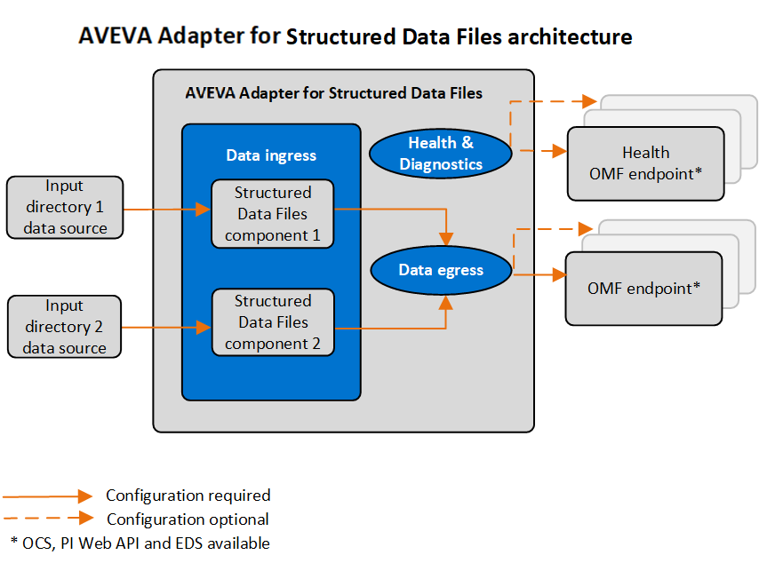

# Overview

AVEVA Adapter for Structured Data Files is a data-collection component that transfers time-series data from source files in a local or remote directory to Open Message Format (OMF) endpoints in AVEVA Data Hub (ADH) or AVEVA PI Servers.

<!--The conceptual information is very light. What type of files? Where do they come from? What sorts of scenarios would this be used in? I wouldn't expect to see installation and configuration information in the main overview page. It seems too detailed. I realize this is what is done on the other apater documents, but I would question it there, too.-->

## Adapter installation

You can install the adapter with a download kit that you can obtain from the [AVEVA Customer Portal](https://my.osisoft.com/). You can install the adapter on devices running either Windows or Linux operating systems.

## Adapter configuration

Using REST API, you can configure all functions of the adapter. The configurations are stored in JSON files. For data ingress, you must define an adapter component in the system components configuration for each data source to which the adapter will connect. You configure each adapter component with the connection information for the data source and the data to collect. For data egress, you must specify destinations for the data, including security for the outgoing connection. Additional configurations are available to egress health and diagnostics data, add buffering configuration to protect against data loss, and record logging information for troubleshooting purposes.

Once you have configured the adapter and it is sending data, you can use administration functions to manage the adapter or individual ingress components of the adapter. Health and diagnostics functions monitor the status of connected devices, adapter system functions, the number of active data streams, the rate of data ingress, the rate of errors, and the rate of data egress.

## EdgeCmd utility

AVEVA also provides the EdgeCmd utility, a proprietary command line tool to configure and administer an adapter on both Linux and Windows operating systems. EdgeCmd utility is installed separately from the adapter.
